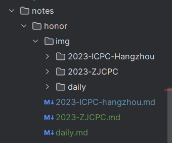

# 使用规范

1、常规的git操作

```bash
git pull
git add
git commit
git push
```

2、部署

```bash
sh .\deploy.sh
```


在编写文档时，为了有效管理，请按此结构放置md文件



在.vuepress/config.ts中，找到这段配置

```ts
        notes: {
            dir: "notes",
            link: "/",
            notes: [
                {
                    dir: "honor",
                    link: "/honor/",
                    sidebar: [
                        {
                            text: "比赛风采",
                            items: ['2023-ICPC-hangzhou']
                        },
                        {
                            text: "日常训练",
                            items: ['daily']
                        }
                    ]
                },
            ]
        }
```

例如我新建了一个md文件，2023-ZJCPC.md，在比赛风采下面展示

```ts
        notes: {
            dir: "notes",
            link: "/",
            notes: [
                {
                    dir: "honor",
                    link: "/honor/",
                    sidebar: [
                        {
                            text: "比赛风采",
                            items: ['2023-ICPC-hangzhou','2023-ZJCPC']
                        },
                        {
                            text: "日常训练",
                            items: ['daily']
                        }
                    ]
                },
            ]
        }
```


