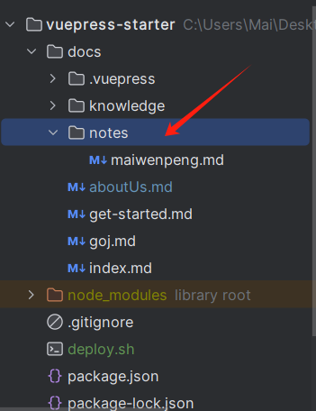

# ZGUC ACM

## 我们是什么

此仓库为ZGUC 程序设计集训队 资源主站点，存放历届成员的学习笔记、赛时风采、OJ等


## 我能做什么

加入本仓库后，可以将自己的笔记上传到此仓库

具体步骤为

1、安装并配置git，注册git账户，自行百度

2、克隆本仓库到本地

```bash
https://github.com/Mai-c1/mai-c1.github.io.git
```

3、在docs/notes文件夹下创建属于自己的md文档,以名字拼音为文件名



4、
