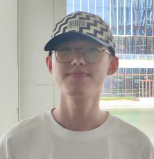
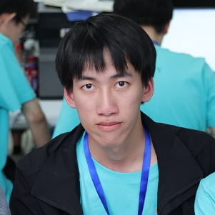
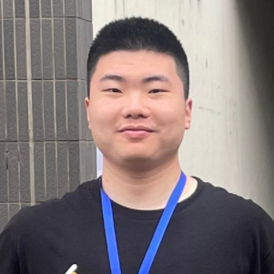
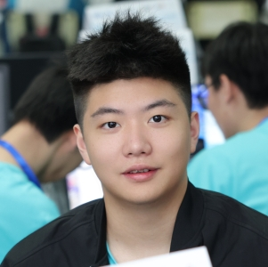
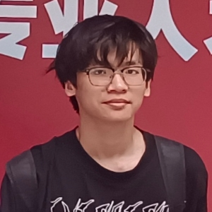
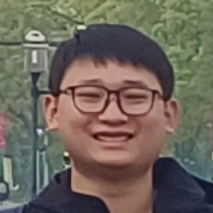
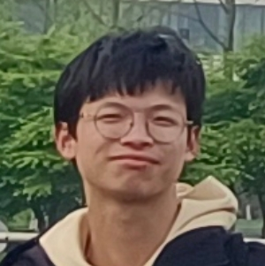

## 退役队员

- 陈家乐 20软件2班

- 2023年浙江省大学省程序设计竞赛铜牌

- 现(2025年8月)为华为OD，就职于华为上海研究所

- 麦文鹏 21软件2班

- 原集训队主力队队长，OJ系统的开发者

- 2023年ICPC区域赛杭州站铜牌

- 2023年浙江省大学省程序设计竞赛铜牌

- 现(2025年8月)就职于国内一线信奥机构-信友队
    

- 张皓杰 21软件3班

- 原集训队主力队员，算法实力最强

- 集训队从0到1发展过程的中流砥柱，广厦大学XCPC比赛的开拓者

- 2024年百度之星决赛银牌

- 2024年ICPC邀请赛武汉站银牌，2024年ICPC邀请赛西安站银牌

- 2023年ICPC区域赛杭州站铜牌

- 2023年浙江省大学省程序设计竞赛铜牌

- 现(2025年8月)就职于信奥培训机构-睿达

- 余瑞 21软件1班

- 原集训队主力队员

- 2024年ICPC邀请赛武汉站银牌，2024年ICPC邀请赛西安站银牌

- 2023年ICPC区域赛杭州站铜牌

- 2023年浙江省大学省程序设计竞赛铜牌

- - 现(2025年8月)为华为OD，就职于华为上海研究所

- 陈斌 21软件3班

- 黄燊锐 22软件1班

- 龚孝天 23软件2班

- 向文寿 23软件1班

- 陈资权 24计算机专升本1班